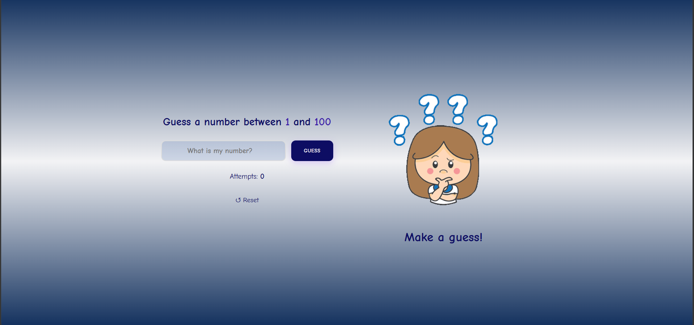
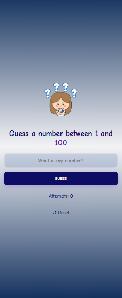

# Guess the Number 🎯

A simple and responsive number guessing game built with **HTML, CSS, and JavaScript**.

The player tries to guess a randomly generated number between 1 and 100 and receives hints to help find the correct number.

## ✨ Features

* Random number generation between 1 and 100
* Higher and lower hints after each guess
* Attempts counter
* Input validation
* Reset button to start a new game
* Character reactions based on the player's guess
* Responsive design for mobile and desktop
* Visual feedback for correct and incorrect guesses

## 🛠️ Built With

* HTML5
* CSS3
* JavaScript
* CSS Variables
* DOM Manipulation
* Responsive Design

## 📸 Screenshots

### 🖥️ Desktop




### 📱 Mobile




## 🌐 Live Demo


[View Live Demo](https://elenahedayat.github.io/guess-number-game/)

## 📁 Project Structure

```text
guess-the-number/
│
├── character.gif
├── index.html
├── style.css
├── script.js
└── README.md
```

## 🚀 How to Run

1. Clone the repository:

```bash
git clone https://github.com/elenahedayat/guess-number-game.git
```

2. Open the project folder.
3. Open `index.html` in your browser.

No additional installation or dependencies are required.

## 👩‍💻 Author

**Elena Hedayat**

[GitHub](https://github.com/elenahedayat)
